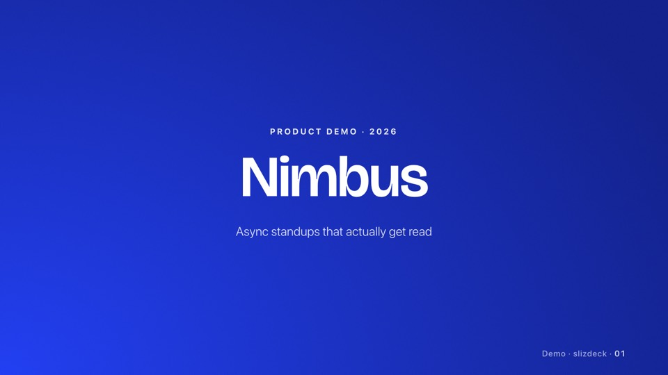
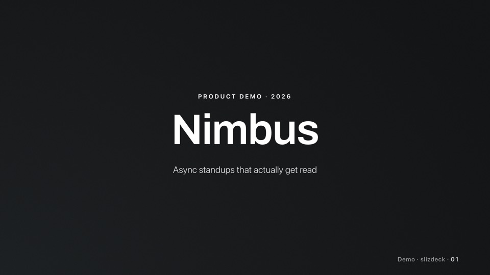
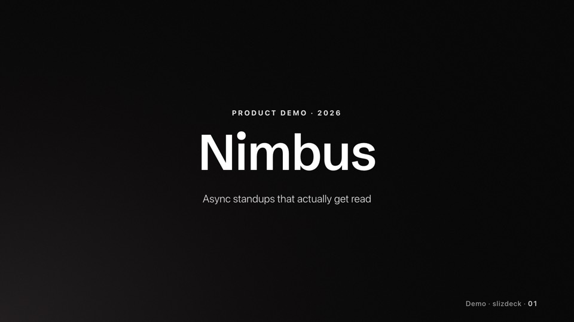
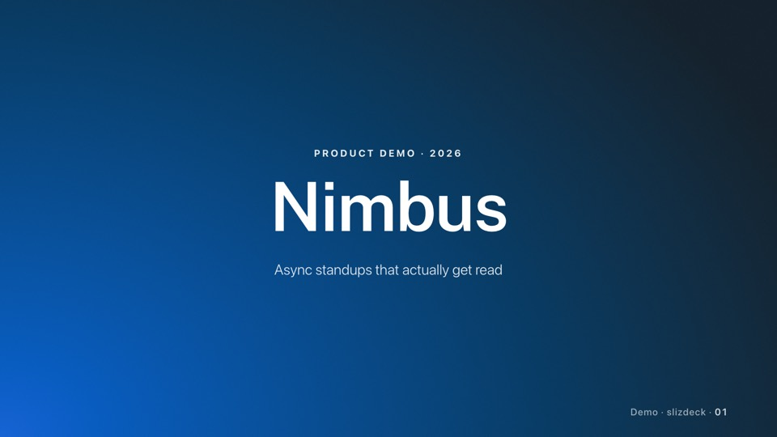
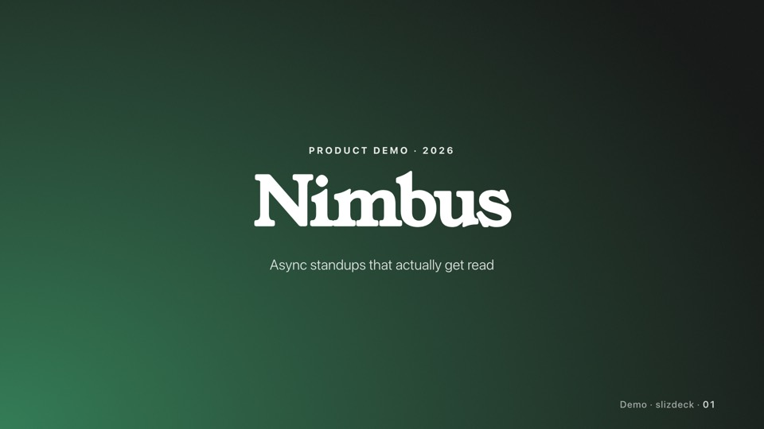
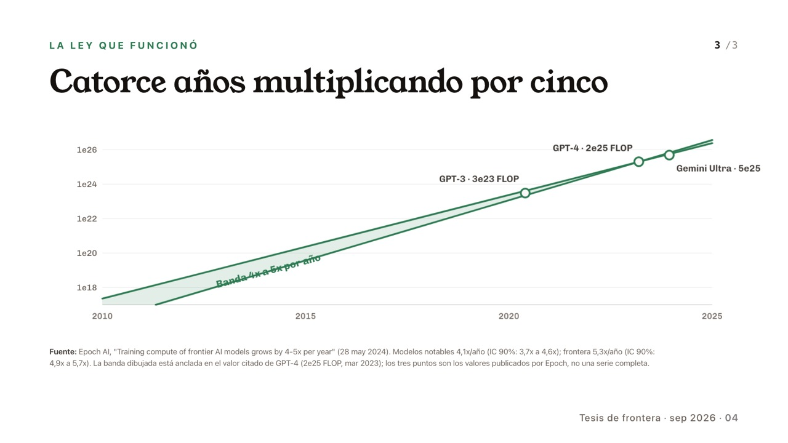
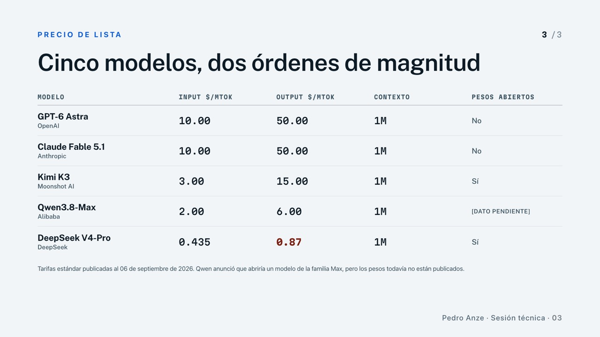
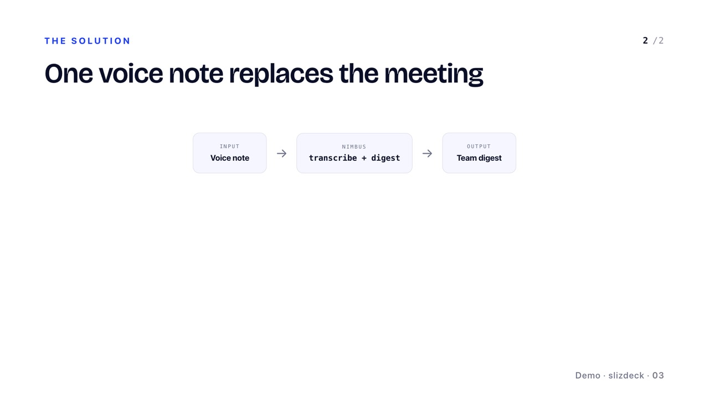

<div align="center">
  

  <p><strong>Pídele a tu agente un pitch deck. Recibe un deck animado, investigado y listo para presentar.</strong></p>

  <p>
    <a href="https://www.npmjs.com/package/slizdeck"></a>
    <a href="https://github.com/pedroanze/slizdeck/actions/workflows/ci.yml"></a>
    <a href="LICENSE"></a>
  </p>

  <p><a href="README.en.md">English</a> · <strong>Español</strong></p>
</div>

<p align="center">
  
</p>

Slizdeck es una [Agent Skill](https://agentskills.io) para **Claude Code, Codex, Gemini CLI y OpenCode**. Le pides *"hazme un pitch deck de 8 slides sobre mi startup"* y el agente investiga el tema, te propone la estructura, te pide las imágenes y datos que faltan, y genera el deck: poco texto, dato duro y un diseño que no parece hecho por IA.

## Instalación

```bash
npx slizdeck install
```

Detecta qué agentes tienes y deja la skill lista en todos. Eso es todo.

<details>
<summary>Otras formas de instalar</summary>

**Plugin de Claude Code** (incluye la auditoría automática después de cada edición):

```
/plugin marketplace add pedroanze/slizdeck
/plugin install slizdeck@slizdeck
```

**[skills.sh](https://skills.sh)**:

```bash
npx skills add pedroanze/slizdeck
```

**Solo en un agente o solo en este proyecto:**

```bash
npx slizdeck install --agent claude,codex
npx slizdeck install --project
```

**Con git**, clonando en la carpeta de skills de tu agente:

```bash
git clone https://github.com/pedroanze/slizdeck ~/.claude/skills/slizdeck
```

</details>

**Requisitos:** Node 20+ y Google Chrome (para exportar y para las validaciones visuales). `npx slizdeck env` revisa que esté todo.

## Cómo se usa

Háblale a tu agente como a un diseñador:

> *"Hazme un pitch deck para inversores sobre Nimbus, una app de standups asíncronos"*
> *"Prepara una charla de 15 minutos sobre el estado de los modelos de IA"*
> *"Agrégale una slide de tracción después de la 4"*
> *"La slide 7 se ve genérica, mejórala"*
> *"Pásalo a PDF y a PowerPoint"*

Para un deck nuevo, la skill sigue estos pasos y te consulta en cada uno antes de avanzar:

1. **Estilo**: eliges uno de los cinco packs, o le das los colores de tu marca.
2. **Brief**: tema, público y duración. El agente investiga en internet y te propone un wireframe slide por slide.
3. **Assets**: te pide las imágenes, logos y cifras reales que faltan. Nada de datos inventados.
4. **Build**: genera el deck con el nivel de animación que elijas.
5. **Audit**: valida contraste, desbordes y textos antes de entregártelo, y mira cada slide renderizada.

Después puedes pedir cambios puntuales ("cambia el pack a terminal", "arregla el texto de la 12") sin rehacer nada.

## Qué recibes

| | |
|---|---|
| **Un `.html` autónomo** | Lo abres en el navegador y presentas: 1920×1080, flechas del teclado, pantalla completa. Sin instalar nada. |
| **PDF** | Una página por slide, liviano, con las animaciones resueltas. |
| **PowerPoint editable** | Cada texto y cada forma en su lugar, editables en PowerPoint o Google Slides, con imágenes y notas del presentador. |

```bash
npx slizdeck export pdf deck.html
npx slizdeck export pptx deck.html
```

## Cinco estilos

Cada pack es un mundo visual completo (paleta, tipografía y reglas de composición), validado contra contraste WCAG y contra los clichés visuales de las interfaces generadas por IA.

<table>
  <tr>
    <td width="50%"><br><strong>terminal</strong>: casi negro, para infra, IA y demos técnicas en sala oscura.</td>
    <td width="50%"><br><strong>paper-white</strong>: blanco literal; el contenido y las cifras cargan todo el peso.</td>
  </tr>
  <tr>
    <td><br><strong>committed</strong>: color dominante, para el pitch que tiene que recordarse.</td>
    <td><br><strong>instrument</strong>: neutro frío, para decks densos en métricas.</td>
  </tr>
  <tr>
    <td><br><strong>editorial</strong>: serif y aire, para charlas con tesis.</td>
    <td>¿Tu marca tiene sus propios colores? Dáselos al agente y los adapta al pack que elijas, validando el contraste.</td>
  </tr>
</table>

## Hecho con slizdeck

Slides de decks generados de punta a punta por la skill, sin tocar el resultado:

<p align="center">
  
</p>
<table>
  <tr>
    <td width="50%"></td>
    <td width="50%"></td>
  </tr>
</table>

Los decks completos, con la bitácora de cada prueba, están en [`examples/`](examples/).

## Actualizar y desinstalar

```bash
npx slizdeck update        # o /plugin update slizdeck@slizdeck
npx slizdeck uninstall
npx slizdeck where         # dónde está instalada y en qué versión
```

## Bueno saber

- **Probada a fondo en Claude Code.** En Codex, Gemini CLI y OpenCode se instala y debería funcionar por el estándar Agent Skills, pero todavía no se probó de punta a punta.
- **El PowerPoint usa las fuentes del estilo.** Si quien lo abre no las tiene instaladas, verá una sustituta; para ese caso existe `npx slizdeck export pptx deck.html --safe-fonts`.
- **El PowerPoint no lleva animaciones**: cada slide va en su estado final.

## Más

- [Roadmap](ROADMAP.md): lo que viene.
- [Contribuir](CONTRIBUTING.md): cómo está armado el repo, cómo agregar un estilo o un patrón, tests.
- [Changelog](CHANGELOG.md).
- ¿Un deck salió mal o tienes una idea? [Abre un issue](https://github.com/pedroanze/slizdeck/issues/new/choose).

Fork/adaptación de [`claude-slides`](https://github.com/marcogalluccio/claude-slides) de Marco Galluccio (MIT), ver [`NOTICE.md`](NOTICE.md). Licencia MIT.
