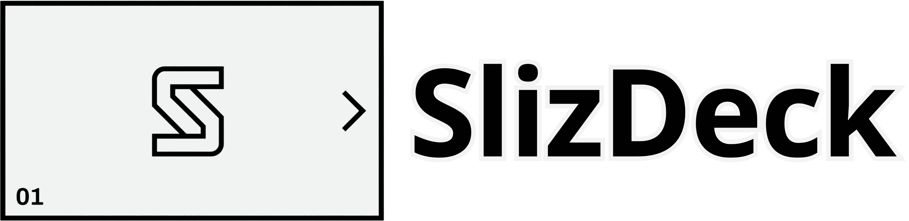

<div align="center">
  
</div>

# Slizdeck

[](https://github.com/pedroanze/slizdeck/actions/workflows/ci.yml)

Genera decks de slides **HTML animados** a partir de tu propio design system, con el contenido investigado en internet. Pensado para pitch decks de startup: minimalista, poco texto, mucha imagen y dato duro — también sirve para charlas, demos y recaps de evento.

Es una [Agent Skill](https://agentskills.io) — funciona en Claude Code, Gemini CLI, Codex, OpenCode y cualquier cliente que soporte el estándar abierto.

## Qué produce

- **Un archivo `.html` autónomo.** Sin build step, sin dependencias de toolchain. Lo abres en cualquier navegador y presentas: canvas 1920×1080, navegación por teclado (←/→/espacio), fullscreen, barra de progreso.
- **Un PDF fiel**, vía impresión nativa del navegador (`Cmd/Ctrl+P`). El PDF exporta el **estado final** de cada slide: animaciones resueltas, contadores en su cifra real, sin el chrome del reproductor.
- **Un PPTX editable** (`node scripts/export-pptx.mjs deck.html`), con texto y formas nativas de PowerPoint — no imágenes incrustadas. Se edita en PowerPoint o Google Slides.

## Cómo usarlo

Le pides algo como *"hazme un pitch deck de 8 slides sobre mi startup"* y la skill conduce el resto de la conversación. No es una sola cadena rígida: son **ocho fases**, cada una con su propio momento de activación. Las primeras seis arman un deck nuevo de punta a punta; `add` y `fix` se activan sueltas sobre un deck que ya existe, sin repetir las anteriores.

| Fase | Se activa con | Qué hace | Referencia |
|---|---|---|---|
| **init** | El disparador inicial, o "cambia la paleta/el pack/la tipografía" | Elegir o cambiar pack visual, colores de marca, tipografía | [reference/init.md](reference/init.md) |
| **brief** | Después de init, o "cambia el tema/tamaño/contenido" | Tema, público, tipo de deck, tamaño, research en internet, arco narrativo, wireframe aprobado por ti | [reference/brief.md](reference/brief.md) |
| **assets** | Después de aprobar el wireframe, o "¿qué imágenes necesito?" | Checklist obligatorio y bloqueante de imágenes, logos y datos reales por slide — no se genera nada hasta resolver cada ítem | [reference/assets.md](reference/assets.md) |
| **build** | Después de resolver assets | Nivel de animación y generación del HTML final | [reference/build.md](reference/build.md) |
| **audit** | Antes de entregar, o "audita el deck" | Validación automática (`scripts/audit.mjs`): contraste, balance HTML, reglas de voz, assets pendientes | [reference/audit.md](reference/audit.md) |
| **export** | "pásalo a PDF/PPTX", "dame las notas" | PDF nativo, PPTX editable, deck sin dependencia de red, speaker notes | [reference/export.md](reference/export.md) |
| **add** | "agrega una slide sobre X", "mete 2 slides entre la 9 y la 10" | Agregar slides a un deck existente, renumerando todo automáticamente (`scripts/renumber.mjs`) — nunca deja huecos ni duplicados | [reference/add.md](reference/add.md) |
| **fix** | "la slide 7 se ve genérica, mejórala" | Corregir o mejorar una o más slides puntuales sin tocar el resto del deck | [reference/fix.md](reference/fix.md) |

**Ejemplo de una petición puntual**, sin recorrer todo el flujo: *"cambia el pack a terminal"* activa solo `init`; *"audita el deck que ya generé"* activa solo `audit`; *"agrégale una slide de FAQ al final"* activa solo `add`. La skill decide qué fase corresponde por lo que pediste, no por dónde vas en la conversación.

## Instalación

Clona el repo directo en la carpeta de skills de tu herramienta:

```bash
# Claude Code
git clone https://github.com/pedroanze/slizdeck ~/.claude/skills/slizdeck

# Gemini CLI
git clone https://github.com/pedroanze/slizdeck ~/.gemini/skills/slizdeck

# Codex
git clone https://github.com/pedroanze/slizdeck ~/.codex/skills/slizdeck

# OpenCode
git clone https://github.com/pedroanze/slizdeck ~/.opencode/skills/slizdeck
```

Para trabajar en la skill sin duplicarla, clona donde prefieras y enlaza:

```bash
git clone https://github.com/pedroanze/slizdeck ~/proyectos/slizdeck
ln -s ~/proyectos/slizdeck ~/.claude/skills/slizdeck
```

La primera vez que se necesite exportar a PPTX, instalar dependencias en la raíz de la skill:

```bash
npm install
```

## Estructura

| Archivo | Rol |
|---|---|
| `SKILL.md` | Punto de entrada: qué dispara la skill y la tabla de fases con su ruteo. |
| `template.html` | Motor del deck: canvas `<deck-stage>`, navegación, sistema de reveals, tokens CSS. |
| `reference/init.md` | Fase init — pack, colores de marca, tipografía. |
| `reference/brief.md` | Fase brief — tema, público, tamaño, research, arco, wireframe. |
| `reference/assets.md` | Fase assets — checklist bloqueante de imágenes/logos/datos. |
| `reference/build.md` | Fase build — nivel de animación y generación del HTML. |
| `reference/audit.md` | Fase audit — qué valida `scripts/audit.mjs` y qué queda a criterio del modelo. |
| `reference/export.md` | Fase export — PDF, PPTX, deck sin red, speaker notes. |
| `reference/add.md` | Fase add — agregar slides a un deck existente sin romper la numeración. |
| `reference/fix.md` | Fase fix — corregir o mejorar una slide puntual sin romper el resto. |
| `reference/hooks.md` | Hook opcional de Claude Code: audita un deck automáticamente después de cada edición. |
| `CHANGELOG.md` | Historial de versiones del engine (`template.html`) — lo que lee `scripts/doctor.mjs`. |
| `CONTRIBUTING.md` | Cómo agregar un style pack/patrón nuevo, correr los tests locales, convención de commits. |
| `.github/workflows/ci.yml` | CI: corre `smoke-test.mjs`, `audit.mjs` y `check-reveal.mjs` en cada push/PR sobre un deck de humo generado en el momento. |
| `reference/design-tokens-schema.md` | Esquema del design system y su mapeo a variables CSS. |
| `reference/design-guidelines.md` | Principios visuales y lista de anti-clichés. |
| `reference/deck-schema.md` | Formato del wireframe, arcos narrativos, niveles de animación. |
| `reference/components.md` | Catálogo de patrones de layout. |
| `reference/media-and-data.md` | Patrones de imagen, métricas, barras y pantalla de inicio (y qué de esto sobrevive al export a PPTX). |
| `reference/animations.md` | Recetas de animación CSS y sus gotchas — solo para nivel HEAVY. |
| `reference/icons.md` | Librería de íconos SVG. |
| `DESIGN.md` · `design.json` | El contrato del sistema visual (roles de color, escala tipográfica, movimiento) en prosa y su espejo estructurado, en formato [DESIGN.md](https://github.com/google-labs-code/design.md). |
| `styles/` | Cinco style packs (terminal, paper-white, committed, instrument, editorial) + su índice. |
| `scripts/apply-style-pack.mjs` | Aplica un pack a un deck fusionando tokens (y su alternativa tipográfica, con `--font=<id>`). |
| `scripts/check-style-pack.mjs` | Valida contrastes y avisa de clichés visuales de IA. |
| `scripts/audit.mjs` | Valida un deck ya generado: contraste, balance HTML, reglas de voz, assets pendientes. |
| `scripts/check-reveal.mjs` | Verifica en Chrome headless que la cascada CSS de `.reveal` resuelva bien al revelarse (`.is-on` gana contra cualquier `r-*`) — atrapa bugs de orden de cascada invisibles en el HTML estático. |
| `scripts/check-overflow.mjs` | Verifica en Chrome headless que ningún texto desborde el canvas 1920×1080 ni se trunque en una línea que no cabe. |
| `scripts/doctor.mjs` | Compara la versión de engine embebida en un deck contra `CHANGELOG.md` y avisa (sin reparar) si le falta algún fix conocido. |
| `scripts/verify-hook.mjs` | Hook opcional de Claude Code que corre `audit.mjs` automáticamente después de editar un deck — ver `reference/hooks.md`. |
| `scripts/export-pptx.mjs` | Exporta un deck a `.pptx` editable (texto y formas nativas, no imágenes). |
| `scripts/make-offline.mjs` | Incrusta las fuentes como `data:` URI para presentar sin depender de red. |
| `scripts/renumber.mjs` | Recalcula `data-label` y `<span class="num">` de todas las slides en orden de documento — usar después de insertar una slide en medio del deck. |
| `scripts/smoke-test.mjs` | Test de regresión: ejercita cada pack con cada alternativa tipográfica. |
| `examples/demo-deck.html` | Deck de ejemplo heredado del fork original, sin modificar (ver `NOTICE.md`). |
| `examples/pitch-showcase.html` | Deck de ejemplo propio de slizdeck (7 slides, pack Paper White) — pasa limpio `audit.mjs` + `check-style-pack.mjs` + `check-reveal.mjs`, referencia de la calidad actual del output. |

## Diseño

Slizdeck trae **cinco style packs**, cada uno un mundo visual completo (paleta, tipografía y reglas de composición), derivados del entorno visual real de la audiencia — documentación técnica, terminales, paneles de datos, prensa — y no de "minimalista" en abstracto. Cada pack trae además **2 alternativas tipográficas curadas** sobre su default.

| Pack | Fondo | Tipografía | Para qué |
|---|---|---|---|
| `terminal` | Casi negro | Archivo + JetBrains Mono | Infra, AI, demos técnicas. Sala oscura con proyector. |
| `paper-white` | Blanco literal | Schibsted Grotesk | Cuando el contenido y las cifras deben cargar todo el peso. |
| `committed` | Cobalto dominante | Bricolage Grotesque + Manrope | El pitch que necesita recordarse. Keynotes, lanzamientos. |
| `instrument` | Neutro frío | Public Sans + Martian Mono | Decks densos en métricas: tracción, unit economics. |
| `editorial` | Blanco puro | Young Serif + Chivo | Charlas con tesis, donde el texto respira. |

Ninguno usa las tipografías ni las combinaciones de color que delatan una interfaz generada por IA, y todos pasan un validador de contrastes:

```bash
node scripts/check-style-pack.mjs styles/terminal.md
```

Comprueba los contrastes WCAG, que primario y acento sean distinguibles entre sí, y avisa si la paleta cae en una zona atractora conocida o si la tipografía está en la lista de *training-data defaults*. Sirve igual para un pack propio armado con los colores de tu marca, o para un deck ya generado (`node scripts/audit.mjs deck.html` lo incluye automáticamente).

Las reglas de composición están en `reference/design-guidelines.md`, verificables mecánicamente con `scripts/check-style-pack.mjs` de arriba. Si además tenés instalada alguna herramienta externa de detección de patrones de diseño, puede dar una segunda opinión más granular sobre los mismos criterios — pero no es necesaria, `check-style-pack.mjs` solo ya alcanza.

No es necesaria para usar slizdeck — es un complemento si ya la tenés instalada.

## Verificar cambios visuales

Sin abrir el navegador a mano:

```bash
# Exportar a PDF
"$(node scripts/lib/find-chrome.mjs)" \
  --headless --disable-gpu --no-pdf-header-footer \
  --print-to-pdf="deck.pdf" --virtual-time-budget=5000 \
  "file://$PWD/tu-deck.html"

# Ver cada página como imagen
pdftoppm -png -r 72 deck.pdf pagina
```

## Limitaciones conocidas

- **PPTX: set cerrado de patrones reconocidos.** `scripts/export-pptx.mjs` reconoce todos los patrones documentados en `reference/media-and-data.md` (imagen a sangre/split, fila de métricas, barras comparativas, progreso/proporción) y los de `reference/components.md` que ya tiene soporte explícito. Un patrón de layout nuevo que no se haya sumado al script **no aparece en el `.pptx` generado, sin aviso** — avisar antes de exportar si el deck usa algo fuera de lo ya soportado.
- **PPTX: degradaciones inherentes al formato** (no son fallos del export, son el trade-off de "texto y formas nativas, cero imágenes incrustadas"): sin animaciones (se exporta el estado final), fuentes sustituidas por equivalentes seguros de Office, gradientes de cover/cierre aplanados a color sólido, imágenes reemplazadas por una forma con el `alt` como etiqueta.
- **Speaker notes van a un `.md` aparte, no al campo nativo de notas de PowerPoint.** `[nombre-deck]-notes.md` con el discurso completo por slide — es una decisión de diseño (el PPTX ya no lleva ninguna otra lógica de contenido embebida), no algo pendiente de conectar.
- **`check-reveal.mjs` y `check-overflow.mjs` pueden fallar de forma intermitente** por arranques en frío de Chrome headless (contención de recursos, no relacionado con el deck evaluado) — ambos reintentan automáticamente hasta 2 veces antes de reportarlo. Si sigue fallando, probablemente hay otro proceso pesado compitiendo por recursos en esa máquina (ej. un navegador real con muchas pestañas abiertas), no un bug del deck.
- **`check-overflow.mjs` no detecta superposición entre elementos** (`no_overlapping_text`), solo desborde de canvas y truncamiento de una línea — generalizar la detección de superposición sin falsos positivos (un badge sobre una esquina es intencional, dos bloques de texto pisándose no) queda fuera del alcance actual.
- **`examples/demo-deck.html` no pasa `check-style-pack.mjs`.** Es el ejemplo heredado del fork original (ver `NOTICE.md`), preservado sin modificar — no usa el sistema de style packs de slizdeck, así que su paleta original no pasa la validación de contraste que sí aplica a un deck generado con esta skill. `examples/pitch-showcase.html` es el ejemplo que sí usa el sistema de packs actual y pasa todo limpio.
- **Documentación 100% en español**, por decisión de alcance (audiencia hispanohablante), no por traducción pendiente.

## Créditos y licencia

Fork/adaptación de [`claude-slides`](https://github.com/marcogalluccio/claude-slides) de Marco Galluccio (MIT). El motor `<deck-stage>` y los catálogos de componentes/animaciones/íconos vienen de ahí; ver `NOTICE.md` para el detalle de qué se heredó y qué se reescribió.

MIT — ver `LICENSE`.
